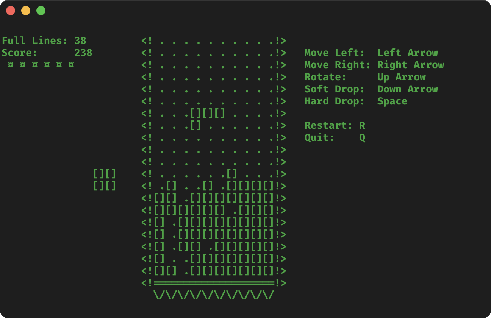

# Tetris CLI

A clone of the popular game Tetris, based on the original Russian Electronika 60 version. It includes most of the game's
features, with some exclusions (e.g., no level system) that may or may not be implemented at a later date.

## Gameplay

### Controls

The primary key mappings are based on [Tetris Online](https://play.tetris.com/) key mappings. Secondary key mappings are
based on common alternatives to the primary keys.

| Action             |   Key   | Alternative |
| ------------------ | :-----: | :---------: |
| Move Left          |    ←    |     [A]     |
| Move Right         |    →    |     [D]     |
| Rotate (Clockwise) |    ↑    |     [W]     |
| Soft Drop          |    ↓    |     [S]     |
| Hard Drop          | [Space] |             |
|                    |         |             |
| Restart Game       |   [R]   |             |
| Quit Game          |   [Q]   |  [Escape]   |

> [!TIP]
> The primary control keys are displayed on the screen.

### Scoring and Game Over

This follows the scoring guideline from [Tetris Online](https://play.tetris.com/), excluding T-spins and combos. Also,
due to not having a level system, all scores are based on level 1.

| Action             |        Score |
| ------------------ | -----------: |
| Single Line Clear  |          100 |
| Double Line Clear  |          300 |
| Triple Line Clear  |          500 |
| Tetris™ Line Clear |          800 |
|                    |              |
| Soft Drop          | 1 x Distance |
| Hard Drop          | 2 x Distance |
